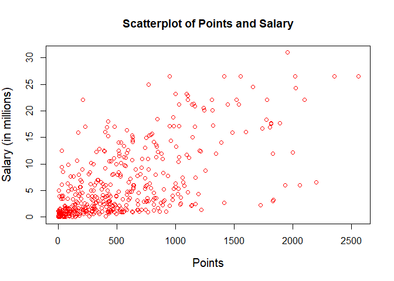

HW 01 - More Vectors
================
Josh Asuncion
September 21, 2017

Research Question
-----------------

``` r
load("data/nba2017-salary-points.RData")
```

### 1) A bit of data preprocessing

``` r
salary_millions <- salary / 1000000

exp_without_r <- as.integer(gsub('R', '0', experience))

position_factor <- as.factor(position)
levels(position_factor) <- c('center', 'power_fwd', 'point_guard', 'small_fwd', 'shoot_guard')

table(position_factor)
```

    ## position_factor
    ##      center   power_fwd point_guard   small_fwd shoot_guard 
    ##          89          89          85          83          95

### 2) Scatterplot of Points and Salary

``` r
plot(points, salary_millions, col='blue', cex.lab=1.5)
```



The scatterplot shows a pattern between `points` and `salary`. The general pattern is that as the number of points increases, the salary increases. Another pattern is that the majority of the data points are clustered in the 0-500 point range and 0-5 salary range.

### 3) Correlation between Points and Salary

``` r
n <- length(player)
x <- points
y <- salary_millions
mean_x <- sum(x) / n
mean_y <- sum(y) / n
var_x <- sum((x - mean_x) ** 2) / (n - 1)
var_y <- sum((y - mean_y) ** 2) / (n - 1)
sd_x <- sqrt(var_x)
sd_y <- sqrt(var_y)
cov_xy <- sum((x - mean_x) * (y - mean_y)) / (n - 1)
cor_xy <- cov_xy / (sd_x * sd_y)
```

### 4) Simple Linear Regression

``` r
slope <- cor_xy * (sd_y / sd_x)
intercept <- mean_y - (slope * mean_x)
y_hat <- intercept + slope * x
summary(y_hat)
```

    ##    Min. 1st Qu.  Median    Mean 3rd Qu.    Max. 
    ##   1.510   2.845   5.206   6.187   8.184  23.398

-   The regression equation to obtain `y_hat` is $\\widehat{Y} = b\_0 + b\_1 \* X$ where *b*<sub>0</sub> is the intercept term, *b*<sub>1</sub> is the slope term, and *X* is a predictor variable.
-   The slope coefficient *b*<sub>1</sub>
