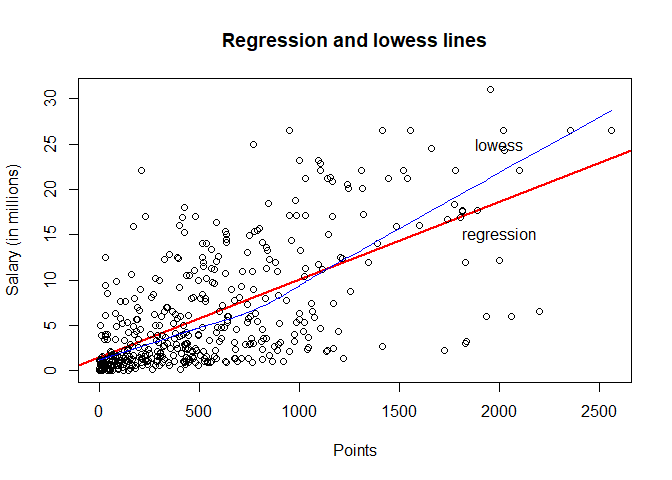

HW 01 - More Vectors
================
Josh Asuncion
September 21, 2017

Research Question
-----------------

``` r
load("data/nba2017-salary-points.RData")
```

### 1) A bit of data preprocessing

``` r
salary_millions <- salary / 1000000

exp_without_r <- as.integer(gsub('R', '0', experience))

position_factor <- as.factor(position)
levels(position_factor) <- c('center', 'power_fwd', 'point_guard', 'small_fwd', 'shoot_guard')

table(position_factor)
```

    ## position_factor
    ##      center   power_fwd point_guard   small_fwd shoot_guard 
    ##          89          89          85          83          95

### 2) Scatterplot of Points and Salary

``` r
plot(points, salary_millions, col='red', cex.lab=1.25, main = 'Scatterplot of Points and Salary', xlab = 'Points', ylab = 'Salary (in millions)')
```


The scatterplot shows a pattern between `points` and `salary`. The general pattern is that as the number of points increases, the salary increases. Another pattern is that the majority of the data points are clustered in the 0-500 point range and 0-5 salary range.

### 3) Correlation between Points and Salary

``` r
n <- length(player)
x <- points
y <- salary_millions
mean_x <- sum(x) / n
mean_y <- sum(y) / n
var_x <- sum((x - mean_x) ** 2) / (n - 1)
var_y <- sum((y - mean_y) ** 2) / (n - 1)
sd_x <- sqrt(var_x)
sd_y <- sqrt(var_y)
cov_xy <- sum((x - mean_x) * (y - mean_y)) / (n - 1)
cor_xy <- cov_xy / (sd_x * sd_y)
```

### 4) Simple Linear Regression

``` r
slope <- cor_xy * (sd_y / sd_x)
intercept <- mean_y - (slope * mean_x)
y_hat <- intercept + slope * x
summary(y_hat)
```

    ##    Min. 1st Qu.  Median    Mean 3rd Qu.    Max. 
    ##   1.510   2.845   5.206   6.187   8.184  23.398

-   The regression equation to obtain `y_hat` is $\\widehat{Y}$ = *b*<sub>0</sub> + *b*<sub>1</sub> \* *X* where *b*<sub>0</sub> is the intercept term, *b*<sub>1</sub> is the slope term, and *X* is a predictor variable.
-   The slope coefficient *b*<sub>1</sub> indicates the direction and steepness of the regression line. *b*<sub>1</sub> equals 0.0085567, which shows that for every additional point, a player on average earns $8556.68 more.
-   The intercept form *b*<sub>0</sub> indicates where the regression line crosses the y-axis. *b*<sub>0</sub> equals 1.5098856, which shows that on avearage a player with 0 points has a salary of $1.509 million.
-   The predicted salary for a player that scores:
    -   0 points: $1.509 million
    -   100 points: $2.365 million
    -   500 points: $5.788 million
    -   1000 points: $10.066 million
    -   2000 points: $18.623 million

``` r
score0 <- intercept + slope * 0
score100 <- intercept + slope * 100
score500 <- intercept + slope * 500
score1000 <- intercept + slope * 1000
score2000 <- intercept + slope * 2000
```

### 5) Plotting the regression line

``` r
plot(points, salary_millions, abline(a = intercept, b = slope, lwd = 2, col = 'red'), xlab = 'Points', ylab = 'Salary (in millions)', main = 'Regression and lowess lines')

lines(lowess(points, salary_millions), col = 'blue')

text(c(2000, 2000), c(13, 28), labels = c('regression', 'lowess'))
```



### 6) Regression residuals and Coefficient of Determination *R*<sup>2</sup>

``` r
residual <- y - y_hat
summary(residual)
```

    ##    Min. 1st Qu.  Median    Mean 3rd Qu.    Max. 
    ## -14.190  -2.794  -1.095   0.000   2.555  18.810

``` r
rss <- sum(residual ** 2)
rss
```

    ## [1] 11299.62

``` r
tss <- sum((y - mean_y) ** 2)
tss
```

    ## [1] 19003.48

``` r
r_squared <- 1 - (rss / tss)
r_squared
```

    ## [1] 0.4053923

### 7) Exploring Position and Experience

``` r
plot(exp_without_r, salary_millions, main = 'Scatterplot with lowess smooth', xlab = 'Years of Experience', ylab = 'Salary (in millions)')

lines(lowess(exp_without_r, salary_millions), col = 'red')
```


``` r
install.packages('scatterplot3d')
```

``` r
library(scatterplot3d)
scatterplot3d(points, exp_without_r, salary_millions)
```


``` r
boxplot(salary_millions ~ position, xlab = 'Position', ylab = 'Salary (in millions)')
```


