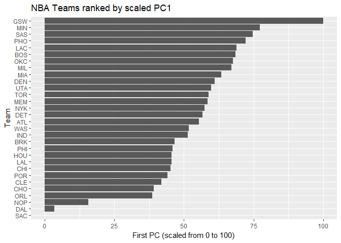

HW03 - Ranking NBA Teams
================
Josh Asuncion
October 14, 2017

``` r
library(ggplot2)
teams <- read.csv("../data/nba2017-teams.csv")
```

Ranking of Teams
----------------

``` r
ggplot(teams, aes(x=reorder(team, salary), y=salary)) + geom_bar(stat="identity") + geom_hline(yintercept=mean(teams$salary), col="red", size=2) + xlab("Team") + ylab("Salary (in millions)") + ggtitle("NBA Teams ranked by Total Salary") + coord_flip()
```


``` r
ggplot(teams, aes(x=reorder(team, points), y=points)) + geom_bar(stat="identity") + geom_hline(yintercept=mean(teams$points), col="red", size=2) + xlab("Team") + ylab("Total Points") + ggtitle("NBA Teams ranked by Total Points") + coord_flip()
```


``` r
ggplot(teams, aes(x=reorder(team, efficiency), y=efficiency)) + geom_bar(stat="identity") + geom_hline(yintercept=mean(teams$efficiency), col="red", size=2) + xlab("Team") + ylab("Total Efficiency") + ggtitle("NBA Teams ranked by Total Efficiency") + coord_flip()
```


-   Ranking NBA teams by total salary shows a large discrepency between the first ranked team and last ranked team. The Cleveland Cavaliers have double the salary as the Phoenix Suns. Using this ranking, the Cavaliers are by far the highest ranked team with around $125 million, with a large distance between them and the second place team, coming at around $115 million. 6 different teams have salaries close to the average. It appears that there are roughly the same number of teams below and above the average salary, such that the distribution is balanced. Although, the bottom ranked teams are far below the average line.
-   Ranking teams by total points tells a different story. The Golden State Warriors have by far the most points, with a large distance of around 500 points more than the second place team, the Los Angeles Clippers. Interestingly, the Cavaliers fall to rank 6 using this ranking system, and the Sacramento Kings take over last place. The distance between the first and last ranked teams is not as great as in the previous barplot. However, with this barplot the results are skewed. The majority of teams reside above the average number of points. The bottom ranked teams are farther away from the average than the top ranked teams, which brings the average down.
-   Ranking teams by efficiency shows that the top ranked teams are in a class of their own. With this ranking, the majority of teams fall below the average number of efficiency. Only 9 teams are above the average, with the Cavaliers and Warriors being the top 2. The barplot is very skewed, with the top 5 or so teams having such high efficiency that they bring the average up. Meanwhile, around 10 teams are slightly below the average. Although the bottom ranked Orlando Magic are far from the average, the bottom ranked teams don't seem to be as far from the average as in the other barplots.

Principal Components Analysis (PCA)
-----------------------------------

``` r
pca <- prcomp(teams[ , c("points3", "points2", "free_throws", "off_rebounds", "def_rebounds", "assists", "steals", "blocks", "turnovers", "fouls")], scale. = TRUE
              )
eig_frame <- data.frame(eigenvalue = round(pca$sdev ** 2, 4),
                        prop = round((pca$sdev ** 2) / sum(pca$sdev ** 2), 4),
                        cumprop = round(cumsum((pca$sdev ** 2) / sum(pca$sdev ** 2)), 4)
                        )
eig_frame
```

    ##    eigenvalue   prop cumprop
    ## 1      4.6959 0.4696  0.4696
    ## 2      1.7020 0.1702  0.6398
    ## 3      0.9795 0.0980  0.7377
    ## 4      0.7717 0.0772  0.8149
    ## 5      0.5341 0.0534  0.8683
    ## 6      0.4780 0.0478  0.9161
    ## 7      0.3822 0.0382  0.9543
    ## 8      0.2603 0.0260  0.9804
    ## 9      0.1336 0.0134  0.9937
    ## 10     0.0627 0.0063  1.0000

``` r
pca_frame <- data.frame(team = teams$team,
                        PC1 = pca$x[ , 1],
                        PC2 = pca$x[ , 2]
                        )
ggplot(pca_frame, aes(x = PC1, y = PC2)) + geom_text(aes(label = team)) + geom_hline(yintercept = 0) + geom_vline(xintercept = 0) + ggtitle("PCA plot (PC1 and PC2)")
```


``` r
PC1 <- pca$x[ , 1]
pca_rescaled <- data.frame(team = teams$team,
                           PC1 = 100 * (PC1 - min(PC1)) / (max(PC1) - min(PC1))
                           )
ggplot(pca_rescaled, aes(x=reorder(team, PC1), y=PC1)) + geom_bar(stat="identity") + xlab("Team") + ylab("First PC (scaled from 0 to 100)") + ggtitle("NBA Teams ranked by scaled PC1") + coord_flip()
```


