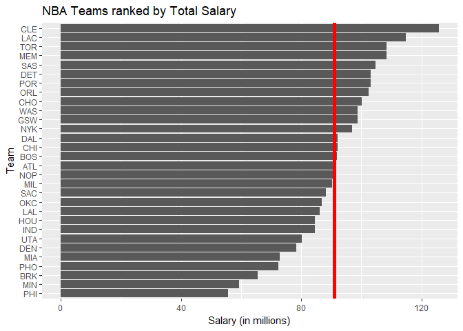
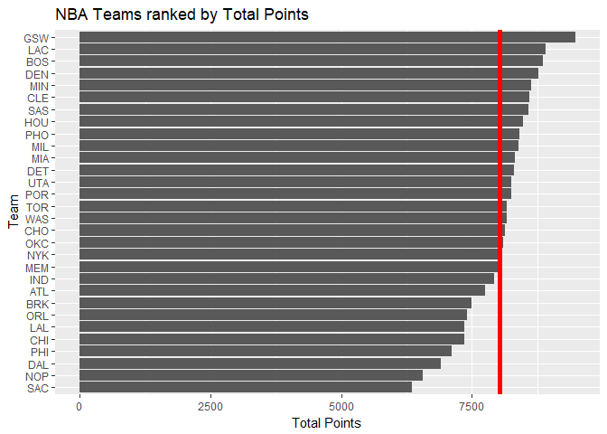
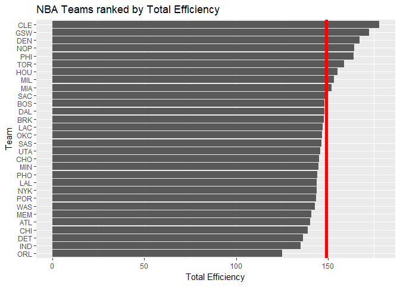
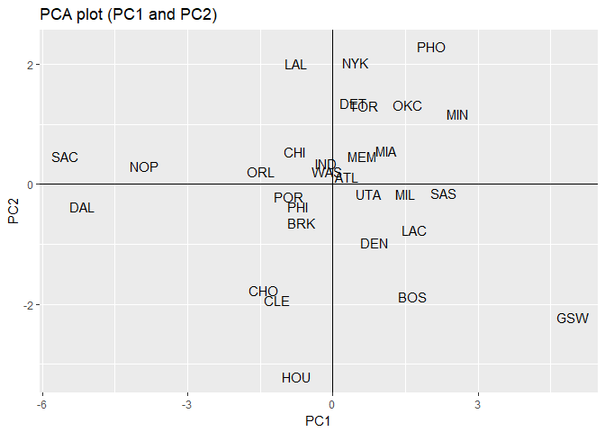
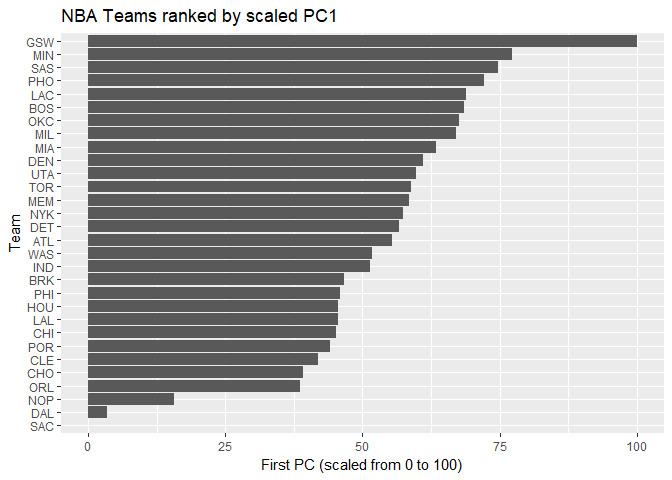

HW03 - Ranking NBA Teams
================
Josh Asuncion
October 14, 2017

``` r
library(ggplot2)
teams <- read.csv("../data/nba2017-teams.csv")
```

Ranking of Teams
----------------

``` r
ggplot(teams, aes(x=reorder(team, salary), y=salary)) + geom_bar(stat="identity") + geom_hline(yintercept=mean(teams$salary), col="red", size=2) + xlab("Team") + ylab("Salary (in millions)") + ggtitle("NBA Teams ranked by Total Salary") + coord_flip()
```



``` r
ggplot(teams, aes(x=reorder(team, points), y=points)) + geom_bar(stat="identity") + geom_hline(yintercept=mean(teams$points), col="red", size=2) + xlab("Team") + ylab("Total Points") + ggtitle("NBA Teams ranked by Total Points") + coord_flip()
```



``` r
ggplot(teams, aes(x=reorder(team, efficiency), y=efficiency)) + geom_bar(stat="identity") + geom_hline(yintercept=mean(teams$efficiency), col="red", size=2) + xlab("Team") + ylab("Total Efficiency") + ggtitle("NBA Teams ranked by Total Efficiency") + coord_flip()
```



-   Ranking NBA teams by total salary shows a large discrepency between the first ranked team and last ranked team. The Cleveland Cavaliers have double the salary as the Phoenix Suns. Using this ranking, the Cavaliers are by far the highest ranked team with around $125 million, with a large distance between them and the second place team, coming at around $115 million. 6 different teams have salaries close to the average. It appears that there are roughly the same number of teams below and above the average salary, such that the distribution is balanced. Although, the bottom ranked teams are far below the average line.
-   Ranking teams by total points tells a different story. The Golden State Warriors have by far the most points, with a large distance of around 500 points more than the second place team, the Los Angeles Clippers. Interestingly, the Cavaliers fall to rank 6 using this ranking system, and the Sacramento Kings take over last place. The distance between the first and last ranked teams is not as great as in the previous barplot. However, with this barplot the results are skewed. The majority of teams reside above the average number of points. The bottom ranked teams are farther away from the average than the top ranked teams, which brings the average down.
-   Ranking teams by efficiency shows that the top ranked teams are in a class of their own. With this ranking, the majority of teams fall below the average number of efficiency. Only 9 teams are above the average, with the Cavaliers and Warriors being the top 2. The barplot is very skewed, with the top 5 or so teams having such high efficiency that they bring the average up. Meanwhile, around 10 teams are slightly below the average. Although the bottom ranked Orlando Magic are far from the average, the bottom ranked teams don't seem to be as far from the average as in the other barplots.

Principal Components Analysis (PCA)
-----------------------------------

``` r
pca <- prcomp(teams[ , c("points3", "points2", "free_throws", "off_rebounds", "def_rebounds", "assists", "steals", "blocks", "turnovers", "fouls")], scale. = TRUE
              )
eig_frame <- data.frame(eigenvalue = round(pca$sdev ** 2, 4),
                        prop = round((pca$sdev ** 2) / sum(pca$sdev ** 2), 4),
                        cumprop = round(cumsum((pca$sdev ** 2) / sum(pca$sdev ** 2)), 4)
                        )
eig_frame
```

    ##    eigenvalue   prop cumprop
    ## 1      4.6959 0.4696  0.4696
    ## 2      1.7020 0.1702  0.6398
    ## 3      0.9795 0.0980  0.7377
    ## 4      0.7717 0.0772  0.8149
    ## 5      0.5341 0.0534  0.8683
    ## 6      0.4780 0.0478  0.9161
    ## 7      0.3822 0.0382  0.9543
    ## 8      0.2603 0.0260  0.9804
    ## 9      0.1336 0.0134  0.9937
    ## 10     0.0627 0.0063  1.0000

``` r
pca_frame <- data.frame(team = teams$team,
                        PC1 = pca$x[ , 1],
                        PC2 = pca$x[ , 2]
                        )
ggplot(pca_frame, aes(x = PC1, y = PC2)) + geom_text(aes(label = team)) + geom_hline(yintercept = 0) + geom_vline(xintercept = 0) + ggtitle("PCA plot (PC1 and PC2)")
```



``` r
pca$rotation[ , c(1,2)]
```

    ##                    PC1         PC2
    ## points3      0.1121782 -0.65652993
    ## points2      0.3601766  0.32892544
    ## free_throws  0.3227564 -0.17651228
    ## off_rebounds 0.3029366  0.35931603
    ## def_rebounds 0.3719432 -0.12808273
    ## assists      0.3125312 -0.44134618
    ## steals       0.3447256 -0.03540585
    ## blocks       0.3162237  0.06131890
    ## turnovers    0.3353958 -0.02169833
    ## fouls        0.3072548  0.28954426

-   Looking at `pca$rotation` for the first 2 PCs, we can interpret how teams are ranked by the scatterplot. Looking at PC1, it appears that all the variables have the same positive coefficient of around 0.3, save for `points3` which has less. This means that each variable has around equal importance in calculating PC1.
-   Looking solely at the PC1 axis, the vast majority of teams are in the range of -1.5 to 1.5, with the Warriors firmly isolated as the top team with a coefficient north of 4.5. Interestingly, the Sacramento Kings, Dallas Mavericks and New Orleans Pelicans are in a class of their own too, but at the far left of the axis as the worst ranked teams.
-   Looking at PC2, `points3` has by far the biggest importance, having a negative impact of around -0.65, while `assists` is the second most important with only -0.44. The next 2 most impactful variables are `points2` and `off_rebounds` with positive coefficients around 0.35.
-   Looking solely at the PC2 axis, the Houston Rockets run away with a coefficient of past -3, with the Cavaliers, Celtics, Warriors and Hornets behind with around -2. The majority of teams fall around the range of -1 to 1.
-   Combining both axes, it seems that the highly ranked teams should be in the fourth quadrant, since it appears desirable to be positive in the PC1 axis and negative in the PC2 axis. The Warriors are by far the top ranked team, with the Celtics at 2. The majority of teams fall around the origin. At the bottom of the rankings are the Pelicans and the Kings.

``` r
PC1 <- pca$x[ , 1]
pca_rescaled <- data.frame(team = teams$team,
                           PC1 = 100 * (PC1 - min(PC1)) / (max(PC1) - min(PC1))
                           )
ggplot(pca_rescaled, aes(x=reorder(team, PC1), y=PC1)) + geom_bar(stat="identity") + xlab("Team") + ylab("First PC (scaled from 0 to 100)") + ggtitle("NBA Teams ranked by scaled PC1") + coord_flip()
```



-   As described above, the PC1 index gives each variable almost equal weight. Besides `points3`, all have nearly the same importance, with positive coefficients around 0.30 to 0.37. This means that a highly ranked team will have a high, positive PC1 score, since it is desirable to be highly ranked in variables such as 2-pointers, rebounds, assists, steals and blocks.
-   When scaling PC1 from 0 to 100, the Warriors are clearly the highest ranked team at 100 with the second place Minnesota Timberwolves almost 25 points behind them. The San Antonio Spurs are third with around 75. With this ranking, the Rockets and Cavaliers are in the bottom 15 teams, with scores less than 50. The Pelicans, Mavericks, and Kings are again the worst ranked teams, with the Kings notably ranked at 0.

Comments and Reflections
------------------------

This was easily the hardest and most time consuming assignment so far. The data preparation phase took a really long time. This was my first time working on a project with this complex file structure, and it was tedious work to make sure all the folders and files were properly organized. I spent a significant portion of time on the R script trying to fix bugs. One such bug was getting `stars()` to work properly. This was one of my first times using R script, and I found R markdown much more preferable in terms of ease to use. I found creating the data dictionaries, csv files, README file, and R script header to be very laborious and not enjoyable.

I found the analysis phase to be much more interesting. I enjoyed creating different rankings, thinking about the meanings behind each, and seeing which ones are better. However, this phase was equally hard and time consuming. I found PCA to be very confusing, and I struggled with being able to plot those graphs. I also struggled conceptually with PCA, and it took me a very long time to make sense of the data. The class slides helped me greatly with this section. Not much was easy in this assignment, and I had to use outside resources. In all, I spent north of 8 hours completing this assignment. However, I found the data topic very interesting. I enjoyed working with the NBA data.
