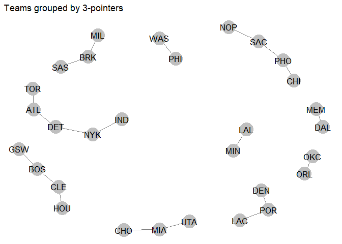
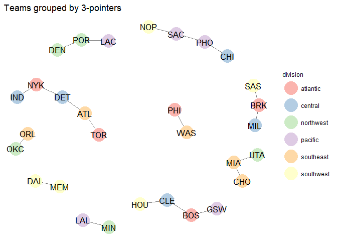
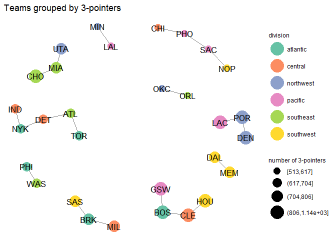
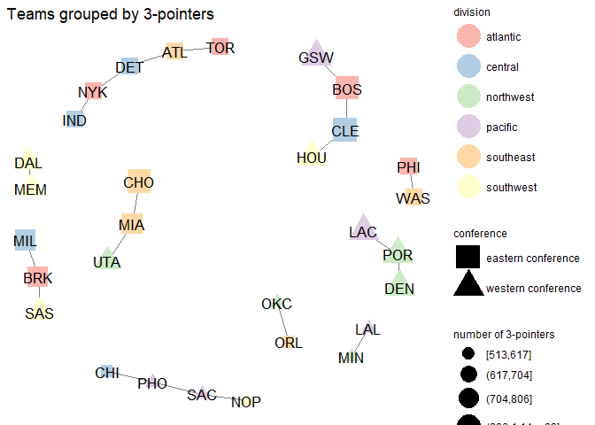
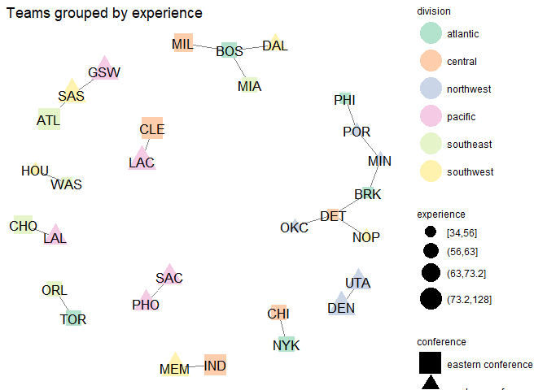
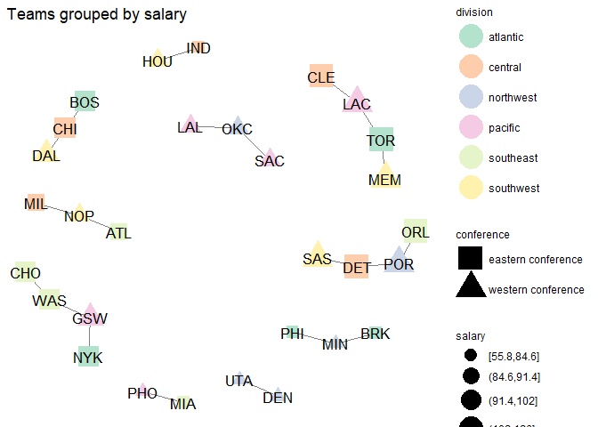
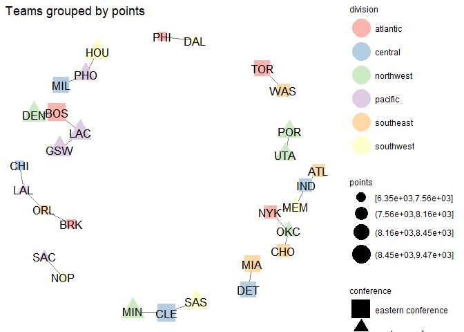
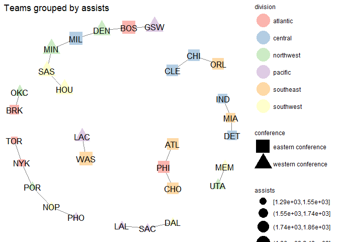

Visualizing Network Diagrams in R
================
Josh Asuncion
October 24, 2017

Introduction
------------

### Background

R is a powerful tool to curate all sorts of data visualizations. The possibilites range from simple scatterplots, barplots, and boxplots, to the more complex streamgraphs, heatmaps, dendrograms, spider charts, and everything in between. In this post, I will explore one type of visualization: network diagrams.


This form of data visualization consists of a network of interconnected nodes. Links are used to represent connections between nodes. Network diagrams can be directed or undirected, meaning a diagram can simply show connections betweeen nodes, or it can show a general flow of the connections.

Network diagrams are very useful in illustrating the relationships between points in a dataset. Nodes can be modified, such as through customizing their size or shape, to differentiate data points. And links can be modified to differentiate relationships, such as through customizing their length or arrows. Looking at the diagram as a whole, one can look for the clustering or density of nodes, or the overall structure of the network layout, to analyze the relationships between the data points.

### Motivation

After working extensively with the 2016-2017 NBA season dataset in homeworks and labs for Stat 133, I was inspired to explore other means of visualizing that data. Specifically, I wanted to further illustrate and analyze how teams compare to each other in terms of their characteristics. That is, I hoped to draw connections between teams through grouping them by their game statistics and observing any patterns or trends.


The purpose of this post is to work with network diagrams and show how they can be a helpful tool in illustrating data. This post will be tailored to the NBA dataset used in class, with the goal of obtaining new insights from that data.

Creating the Network Diagram
----------------------------

### Data Preprocessing

There are several libraries you can use to create network diagrams, such as `igraph`, `ggnetwork`, and `networkD3`. This post uses `ggnet2` which is available from the `GGally` package. `GGally` is dependent upon the `network`, `sna`, and `ggplot2` packages.

To use `ggnet2`, install `GGally` along with `network`, `sna`, and `ggplot2`.

``` r
install.packages("GGally")
install.packages("network")
install.packages("sna")
install.packages("ggplot2")
```

Load the required libraries.

``` r
library(GGally)
library(network)
library(sna)
library(ggplot2)
```

The data I will be working with is in the `nba2017-teams.csv` file generated from Homework 03. The dataset contains game statistics by team from the 2016-2017 NBA season. It includes statistics such as experience, salary, 2-pointers, 3-pointers, assists, steals, blocks and efficiency.

Import the dataset using `read.csv()`.

``` r
# set stringsAsFactors = FALSE to keep team names as characters
data <- read.csv("../data/nba2017-teams.csv", stringsAsFactors = FALSE)
# remove unnecessary first column which contains integers from 1 to 30
data <- data[-1]
# show first 5 rows of data
head(data, n = 5)
```

    ##   team experience salary points3 points2 free_throws points off_rebounds
    ## 1  ATL         93  90.89     626    2254        1373   7759          807
    ## 2  BOS         63  91.92     985    2183        1536   8857          744
    ## 3  BRK         52  65.45     738    1950        1381   7495          608
    ## 4  CHI         58  92.08     565    2162        1330   7349          865
    ## 5  CHO         66 100.25     808    2102        1499   8127          634
    ##   def_rebounds assists steals blocks turnovers fouls efficiency
    ## 1         2537    1784    601    354      1136  1329   140.3269
    ## 2         2698    2069    617    341      1037  1686   148.2525
    ## 3         2546    1593    547    372      1152  1522   147.7823
    ## 4         2416    1746    605    339       952  1275   139.1025
    ## 5         2636    1805    550    320       827  1198   145.2994

### Comparing Teams by `points3`

A matrix will have to be properly formatted in order to work with `ggnet2`. One way in which the data can be arranged is with an edge list.


An edge list is a two-column matrix where the data points in the source column are connected to the points in the target column. In this case, the source column will contain each NBA team, and the target column will contain the team most similar to each team, determined through a tested statistic. In this example, I will use `points3` which is a column containing the number of 3-pointers made by each team.

Create an empty matrix `teams` with two empty columns, and give its first column the list of teams in `data`.

``` r
# set nrow = 30 for 30 teams and ncol = 2 for source and target columns
teams <- matrix(NA, nrow = 30, ncol = 2)
teams[ , 1] <- data[ , 1]
```

To determine the target team for each team, a for loop is needed. One by one, it will go through each team, compare that team's 3-point statistic with every other team's 3-point statistic, choose the closest team, and assign the closest team as the target team.

A caveat includes making sure that we do not compare a source team to itself. And in the case of a tie, `which.min()` will arbitrarily choose the first closest team.

``` r
for (i in 1:30) {
# create a test matrix and set it to the dataset of 29 other teams
  test <- data[-i, ]
# find the index of the team that is the closest to the source team in terms of points3
  closest <- which.min(abs(data[i, "points3"] - test[ , "points3"]))
# set the target of the source team equal to the closest team
  teams[i, 2] <- test[closest, 1]
}
# show first 10 rows
head(teams, n = 10)
```

    ##       [,1]  [,2] 
    ##  [1,] "ATL" "TOR"
    ##  [2,] "BOS" "GSW"
    ##  [3,] "BRK" "SAS"
    ##  [4,] "CHI" "PHO"
    ##  [5,] "CHO" "MIA"
    ##  [6,] "CLE" "BOS"
    ##  [7,] "DAL" "MEM"
    ##  [8,] "DEN" "POR"
    ##  [9,] "DET" "ATL"
    ## [10,] "GSW" "BOS"

### Plotting the Connections

After setting a target team for each source team in `teams`, the `network()` function is then needed to convert `teams` into a network to be passed into `ggnet2`.

Since we are working with an edge list, set the `matrix.type` argument in `network()` equal to `"edgelist"`. The `network()` function also has the optional paramter `directed`, which if set equal to `TRUE` will include an arrow for each link.

``` r
net = network(teams, directed = FALSE, matrix.type="edgelist")
# set label = TRUE to see label for each node
ggnet2(net, label = TRUE) + ggtitle("Teams grouped by 3-pointers")
```

    ## Loading required package: scales



The resulting network diagram shows how teams are grouped together using `points3`. For instance, the Warriors (GSW), Celtics (BOS), Cavaliers (CLE), and Rockets (HOU) are more similar to each other in terms of 3-pointers than they are with the other teams. Thus, they are grouped together into a class of their own.

### Adding Color

As with other plots, network diagrams can be further customized. To illustrate this, let's keep the previously generated network diagram and color code the teams by the division they belong to.

Create vectors for each NBA division and their corresponding teams.

``` r
atlantic <- c('BOS', 'BRK', 'NYK', 'PHI', 'TOR')
central <- c('CHI', 'CLE', 'DET', 'IND', 'MIL')
southeast <- c('ATL', 'CHO', 'MIA', 'ORL', 'WAS')
northwest <- c('DEN', 'MIN', 'OKC', 'POR', 'UTA')
pacific <- c('GSW', 'LAC', 'LAL', 'PHO', 'SAC')
southwest <- c('DAL', 'HOU', 'MEM', 'NOP', 'SAS')
```

Now, we need to create a `division` vector of length 30 which contains the division of each team in the order that they appear in `net`. Use a for loop to go through each team and assign its division to `division`.

``` r
division <- character(length = 30)
for (i in 1:30) {
# network.vertex.names(net) gives you a vector of the teams in net
# use %in% to see if the team is an element in atlantic
  if (network.vertex.names(net)[i] %in% atlantic) {
# assign the ith element in division to atlantic
    division[i] <- "atlantic"
  } else if (network.vertex.names(net)[i] %in% central) {
    division[i] <- "central"
  } else if (network.vertex.names(net)[i] %in% southeast) {
    division[i] <- "southeast"
  } else if (network.vertex.names(net)[i] %in% northwest) {
    division[i] <- "northwest"
  } else if (network.vertex.names(net)[i] %in% pacific) {
    division[i] <- "pacific"
  } else {
    division[i] <- "southwest"
  }
}
head(division, n = 10)
```

    ##  [1] "southeast" "atlantic"  "atlantic"  "central"   "southeast"
    ##  [6] "central"   "southwest" "northwest" "central"   "pacific"

Use `set.vertex.attribute()` to give `net` a new attribute through which we can classify each team. The `set.vertex.attribute()` function takes in a network, the name of the attribute, and a vector of values of the attribute to be set. In this case, the attribute is the division, and we pass in the `division` vector as the values.

Plot the network diagram, but now set `color = "division"` to color the nodes by division. `ggnet2` will automatically add a legend for division.

``` r
# create a new attribute called "division"
set.vertex.attribute(net, "division", division)
# create a vector of color schemes to choose at random
colors <- c("Set2", "Set3", "Pastel1", "Pastel2")
# palette chooses the color scheme
# use sample(colors, 1) to randomly pick a color scheme
ggnet2(net, label = TRUE,
       color = "division", palette = sample(colors, 1)
       ) + ggtitle("Teams grouped by 3-pointers")
```



### Differentiating by Size and Shape

In addition to color, we can customize network diagrams to have nodes with varying sizes and shapes. This customization is often helpful to further distinguish data points.

To differentiate by size, first we need to create a `value` vector which will contain each team's `points3` value, or in other words the number of made 3-pointers.

``` r
value <- numeric(length = 30)
for (i in 1:30) {
  value[i] <- data[i, "points3"]
}
```

Create a new attribute called `"value"` to apply onto `net`. This will allow `ggnet2` to differentiate nodes by size according to each team's `points3` value.

``` r
set.vertex.attribute(net, "value", value)
# set the size argument to the "value" attribute
# set size.cut = TRUE to separate node sizes by quartile
# set size.legend = "number of 3-pointers" to relabel the legend name
ggnet2(net, label = TRUE,
       color = "division", palette = sample(colors, 1),
       size = "value", size.cut = TRUE, size.legend = "number of 3-pointers"
       ) + ggtitle("Teams grouped by 3-pointers")
```



We can also differentiate nodes in terms of shape. Since we color coded the teams by division, let's assign node shape by the conference each team belongs to.

Create `east_conference` and `west_conference`, which are vectors containing the teams that belong in each.

``` r
east_conference <- c(atlantic, central, southeast)
west_conference <- c(northwest, pacific, southwest)
```

Similar to working with `division`, create a `conference` vector which contains the conference of each team in the order that they appear in `net`.

``` r
conference <- character(length = 30)
for (i in 1:30) {
  if (network.vertex.names(net)[i] %in% east_conference) {
    conference[i] <- "eastern conference"
  } else {
    conference[i] <- "western conference"
  }
}
head(conference, n = 10)
```

    ##  [1] "eastern conference" "eastern conference" "eastern conference"
    ##  [4] "eastern conference" "eastern conference" "eastern conference"
    ##  [7] "western conference" "western conference" "eastern conference"
    ## [10] "western conference"

Give `net` a new attribute called `"conference"`, which we can then pass into `ggnet2` to distinguish nodes by conference.

``` r
set.vertex.attribute(net, "conference", conference)
# set the shape argument to the "conference" attribute
# shape.palette chooses the shapes
ggnet2(net, label = TRUE,
       color = "division", palette = sample(colors, 1),
       size = "value", size.cut = TRUE, size.legend = "number of 3-pointers",
       shape = "conference", shape.palette = c("eastern conference" = 15,
                                               "western conference" = 17)
       ) + ggtitle("Teams grouped by 3-pointers")
```



### Creating the Function `group_teams_by()`

Up to now I've worked exclusively with `points3`. It would be much more beneficial to compare the teams with additional statistics, such as salary, free throws, points, and steals. To do so, I will generalize the work we've done by creating the function `group_teams_by()`, which will take in a statistic and return a network diagram grouping the teams by that statistic.

``` r
# x is a statistic from the dataset inputted as a string
group_teams_by <- function(x) {
  teams <- matrix(NA, nrow = 30, ncol = 2)
  teams[ , 1] <- data[ , 1]
  for (i in 1:30) {
    test <- data[-i, ]
    closest <-  which.min(abs(data[i, x] - test[ , x]))
    teams[i, 2] <- test[closest, 1]
  }
  value <- numeric(length = 30)
  for (i in 1:30) {
    value[i] <- data[i, x]
  }
  net <- network(teams, directed = FALSE, matrix.type="edgelist")
  set.vertex.attribute(net, "division", division)
  set.vertex.attribute(net, "conference", conference)
  set.vertex.attribute(net, x, value)
  ggnet2(net, label = TRUE,
         color = "division", palette = sample(colors, 1),
         size = x, size.cut = TRUE,
         shape = "conference", shape.palette = c("eastern conference" = 15,
                                                 "western conference" = 17)
         ) + ggtitle(paste("Teams grouped by", x, sep = " "))
}
```

Now we can produce network diagrams that take in the other statistics.

``` r
# show the available statistics
colnames(data)
```

    ##  [1] "team"         "experience"   "salary"       "points3"     
    ##  [5] "points2"      "free_throws"  "points"       "off_rebounds"
    ##  [9] "def_rebounds" "assists"      "steals"       "blocks"      
    ## [13] "turnovers"    "fouls"        "efficiency"

``` r
group_teams_by("experience")
```



``` r
group_teams_by("salary")
```



``` r
group_teams_by("points")
```



``` r
group_teams_by("assists")
```



``` r
group_teams_by("efficiency")
```


Conclusion
----------

Network diagrams have their drawbacks. They can become too cluttered and hard to read if there are too many nodes to plot. In addition, a network diagram works well in illustrating and categorizing data, but it is not an accurate tool in precisely measuring that data.

However, network diagrams remain a useful tool in data visualization. I believe R users should be able to create visualizations beyond the basic scatterplots and barplots. Creating engaging graphics is a significant aspect of R, and users can greatly benefit from having expertise in data visualization.

### References

The following resources were used to obtain a mastery of network diagrams, in addition to resources used for further research on R, R Markdown, data visualization, etc.

-   <https://datavizcatalogue.com/methods/network_diagram.html>
-   <http://www.r-graph-gallery.com/portfolio/network/>
-   <https://briatte.github.io/ggnet/>
-   <http://kateto.net/networks-r-igraph>
-   <https://cran.r-project.org/web/packages/ggCompNet/vignettes/examples-from-paper.html>
-   <http://www.r-graph-gallery.com/258-input-format-for-the-ggnet2-library/>
-   <https://www.rdocumentation.org/packages/base/versions/3.4.1/topics/which.min>
-   <https://stat.ethz.ch/pipermail/r-help/2005-August/077420.html>
-   <https://stackoverflow.com/questions/37069079/r-find-nearest-points-in-matrix>
-   <https://stackoverflow.com/questions/12614953/how-to-create-a-numeric-vector-of-zero-length-in-r>
-   <https://yihui.name/knitr/demo/output/>
-   <http://www.sthda.com/english/wiki/r-plot-pch-symbols-the-different-point-shapes-available-in-r>
-   <https://stat.ethz.ch/R-manual/R-devel/library/base/html/row.names.html>
-   <http://www.mjdenny.com/Preparing_Network_Data_In_R.html>
-   <https://stackoverflow.com/questions/1169248/r-function-for-testing-if-a-vector-contains-a-given-element>
-   <https://stat.ethz.ch/R-manual/R-devel/library/base/html/sample.html>
-   <http://www.sthda.com/english/wiki/colors-in-r>
