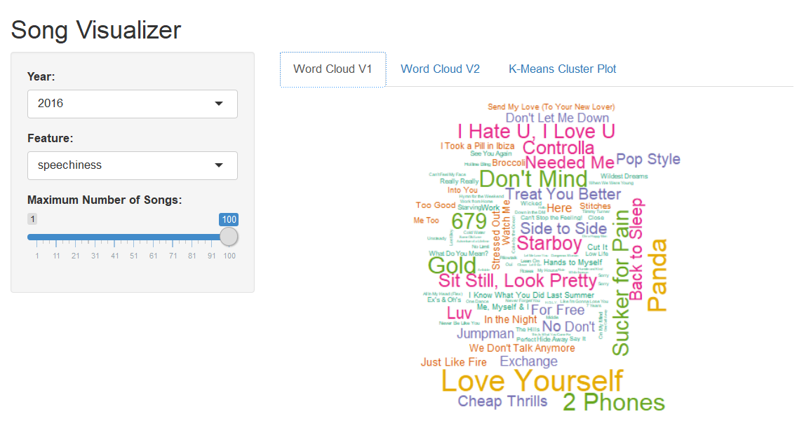
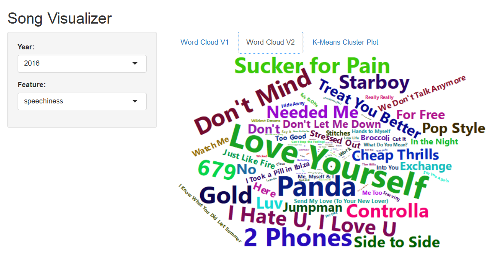
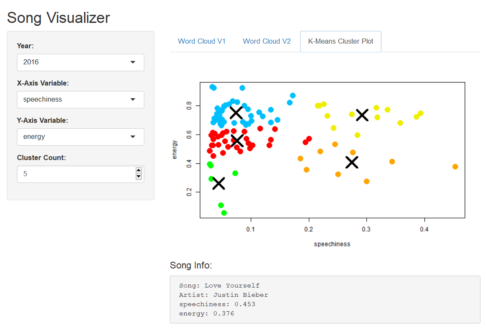

```{r setup, include=FALSE}
knitr::opts_chunk$set(echo = TRUE)
```

## Introduction


R users are capable of creating all sorts of visualizations, from stream graphs and heat maps to chord diagrams and network diagrams. But R is an even more powerful tool with the ability to create interactive visualizations, through the use of Shiny web apps. In this post, I will show how Shiny can be used to create two types of interactive visualizations: word clouds and k-means cluster plots.


### Motivation

After learning how to work with Shiny apps in a previous homework, I wanted to see what other visualizations were possible to make. To my surprise, I learned that word clouds are supported in R. I desired to learn how to make these visualizations. And after working with my data, I realized another way to visualize the data would be through k-means cluster plots, so I desired to learn how to make these as well.

On top of this, I discovered that a capability of Shiny is an interactive hover feature that allows the user to hover over data and view information. I thought this feature would be very useful for the cluster plot, so I sought to learn how to implement it.

I hope to offer a glimpse into the power of Shiny apps and what they are capable of. There are many different visualizations that can be made with R and Shiny, and I hope this post conveys that idea.

### Background


The datasets I am working with are 5 csv files containing data about the top 100 songs on [Billboard's](https://www.billboard.com/) year-end chart from 2012 to 2016. The data was obtained in a project for another class, using [Spotify's API](https://developer.spotify.com/web-api/). Since the data was collected using Python, which is not relevant to this post, I will not go over how the csv files were created. However, for those interested, the project is on GitHub and can be found [here](https://github.com/anatasiavela/Spot-the-Future/tree/master).


Spotify defines a list of audio features, and it gives each song uploaded a value for each of its features. The features in the datasets are:

* danceability
* energy
* key
* loudness
* mode
* speechiness
* acousticness
* instrumentalness
* liveness
* valence
* tempo
* duration_ms
* time_signature

Further description about these features can be found [here](https://developer.spotify.com/web-api/get-several-audio-features/). In addition, the datasets contain the song's name, the song's artist, and the song's Spotify ID.

### Notes

This post uses two different wordcloud libraries. As I did research on how to create word clouds in R, I came across both [Wordcloud](https://cran.r-project.org/web/packages/wordcloud/wordcloud.pdf) and [Wordcloud2](https://github.com/Lchiffon/wordcloud2). Although Wordcloud2 is meant to be an improved version of Wordcloud, I didn't find one to be better than the other in their current states. Furthermore, I thought they were different enough such that it was worthwhile to cover both libraries.

This post goes over how to build the Shiny app and contains code that belong in a Shiny app file. To create and run the app, you will need to follow along with the code, which will be displayed here, in your own Shiny app file. However, the app produced through this post is published online and can be found at:

* https://joshasuncion.shinyapps.io/song_visualizer/

The app contains 3 tabs. The first tab uses version 1 of Wordcloud and gives you the ability to change the year, the measured feature, and the maximum number of songs plotted. The year determines which songs are plotted in the word cloud, the feature determines how large a song is plotted based on that song's feature value, and the maximum number of songs plotted determines how large the word cloud is.

The second tab uses version 2 of Wordcloud and is identical to the first tab except for being unable to change the maximum number of songs plotted. This version loses that capability. However, this version automatically adds a hover feature where hovering over a song shows its details.

The third tab contains the k-means cluster plot, where you are able to change the year, the X and Y variables, and the number of clusters. The year determines which songs are plotted, the variables determine which features are used for the plot, and the number of clusters determines how the data points are clustered together. In addition, a hover feature is added to the plot where you can hover over a point and see details of the song, artist, and features.

## Shiny App Preparation

*Before the UI and server components in your Shiny app file, add the following code:*

For Wordcloud, install the `wordcloud` package along with its dependency package `RColorBrewer`, and load the libraries.

```r
install.packages("wordcloud")
install.packages("RColorBrewer")
library("wordcloud")
library("RColorBrewer")
```

For Wordcloud2, `devtools` and `install_github()` are needed to install the `wordcloud2` package.

```r
require(devtools)
install_github("lchiffon/wordcloud2")
library("wordcloud2")
```

The k-means cluster plot uses functions that are native to R and doesn't need any packages to be loaded. However, to run the Shiny app, the `shiny` package will need to be loaded.

```r
library("shiny")
```

Download the csv files from the [GitHub repository](https://github.com/anatasiavela/Spot-the-Future/tree/master/data/cleandata) into a data folder inside your Shiny app folder, and read in the csv files as R objects.

```{r}
top_2012 <- read.csv("../app/data/top_songs_2012.csv")
top_2013 <- read.csv("../app/data/top_songs_2013.csv")
top_2014 <- read.csv("../app/data/top_songs_2014.csv")
top_2015 <- read.csv("../app/data/top_songs_2015.csv")
top_2016 <- read.csv("../app/data/top_songs_2016.csv")
# show first 5 rows
head(top_2016, n = 5)
```

Remove the ID column, which is not necessary for the purposes of this post.

```{r}
top_2012$id <- NULL
top_2013$id <- NULL
top_2014$id <- NULL
top_2015$id <- NULL
top_2016$id <- NULL
```

Create vectors for the file names and the feature names, which will later be referred to in the Shiny app.

```{r}
years <- c("2012", "2013", "2014", "2015", "2016")
features <- colnames(top_2012)[3:15]
features
```

Create the function `rescale()`, which will later be necessary when formatting the data for the word clouds.

```r
rescale <- function(x, xmin, xmax) {
  100 * (x - xmin) / (xmax - xmin)
}
```

Create the function `get_data()`, which will later be necessary to link the year from `years`, which is chosen in the app, with the corresponding data frame.

```r
get_data <- function(x) {
  if (x == "2012") {
    top_2012
  } else if (x == "2013") {
    top_2013
  } else if (x == "2014") {
    top_2014
  } else if (x == "2015") {
    top_2015
  } else if (x == "2016") {
    top_2016
  }
}
```

## UI Component

*For the UI component of your Shiny app, add the following code:*

To create 3 different tabs, conditional panels will be needed. Set up the structure of the UI component to take this into account.

```r
# define UI for application
ui <- fluidPage(
  
  # application title
  titlePanel("Song Visualizer"),
  
  # sidebar with conditional panels for multiple tabs
  sidebarLayout(
    sidebarPanel(
      
      # first tab
      conditionalPanel(...),
      
      # second tab
      conditionalPanel(...),

      # third tab
      conditionalPanel(...)),
    
    # show outputs for each tab
    mainPanel(
      tabsetPanel(type = "tabs",
                  
                  # first tab
                  tabPanel(...),
                  
                  # second tab
                  tabPanel(...),

                  # third tab
                  tabPanel(...),
                  
                  id = "tabselected"))
  )
)
```

The first tab takes in year, feature, and max number as inputs. Add these to the first conditional panel. In addition, output the first word cloud (version 1 of Wordcloud) with `plotOutput()` in the first tab panel.

```r
# first tab
conditionalPanel(condition = "input.tabselected==1",
                 selectInput("year1", "Year:",
                             years, selected = "2016"),
                 selectInput("feature1", "Feature:",
                             features, selected = "speechiness"),
                 # each dataset contains 100 songs
                 sliderInput("max", "Maximum Number of Songs:",
                             min = 1,  max = 100,  value = 100))
                             
tabPanel("Word Cloud V1", value = 1,
         plotOutput("wordcloud1"))
```

The second tab takes in year and feature as inputs. Add these to the second conditional panel. To output the second word cloud (version 2 of Wordcloud), you need to use `wordcloud2Output()` in the second tab panel.

```r
# second tab
conditionalPanel(condition = "input.tabselected==2",
                 selectInput("year2", "Year:",
                             years, selected = "2016"),
                 selectInput("feature2", "Feature:",
                             features, selected = "speechiness"))

tabPanel("Word Cloud V2", value = 2,
         wordcloud2Output("wordcloud2"))
```

The third tab takes in year, X variable, Y variable, and number of clusters as inputs. Add these to the third conditional panel. Use `plotOutput()` to output the cluster plot in the third tab panel. To enable the hover feature, give the argument `hover = hoverOpts(id = "plot_hover")` inside of `plotOutput()`. In addition, add a text output to the third tab panel using `verbatimTextOutput()` to hold the hover information.

```r
# third tab
conditionalPanel(condition = "input.tabselected==3",
                 selectInput("year3", "Year:",
                             years, selected = "2016"),
                 selectInput("x_var", "X-Axis Variable:",
                             features, selected = "speechiness"),
                 selectInput("y_var", "Y-Axis Variable:",
                             features, selected = "energy"),
                 # choose 9 as highest number of clusters to form
                 numericInput('clusters', 'Cluster Count:',
                              min = 1,
                              max = 9,
                              value = 5))

tabPanel("K-Means Cluster Plot", value = 3,
         plotOutput("kplot",
                    hover = hoverOpts(
                      id = "plot_hover")),
         # add title for text box
         h4("Song Info:"),
         verbatimTextOutput("hover_info"))
```

## Server Component

*For the server component of your Shiny app, add the following code:*

Set up the structure of the server component to have 4 outputs. The first tab has `wordcloud1` as its output, and it uses `renderPlot()` to output the word cloud. The second tab has `wordcloud2` as its output, and it instead uses `renderWordcloud2()` to output the word cloud. The third tab has `kplot` and `hover_info` as outputs, using `renderPlot()` and `renderPrint()`.

```r
# define server logic
server <- function(input, output) {
  
  # plot word cloud in first tab
  output$wordcloud1 <- renderPlot({...})
  
  # plot word cloud in second tab
  output$wordcloud2 <- renderWordcloud2({...})
  
  # plot k-means cluster plot in third tab
  output$kplot <- renderPlot({...})
  
  # generate song info in third tab
  output$hover_info <- renderPrint({...})
}
```

### Wordcloud

To create the first word cloud, you need to use `get_data()` on the inputted year, which will be one of the years in `years`, to get the corresponding data frame. The inputted feature will need to be saved as well.

```r
# plot word cloud in first tab
output$wordcloud1 <- renderPlot({
  
  # get data of chosen year
  data = get_data(input$year1)
  
  # get chosen feature
  feature = input$feature1
  
  ...
  
})
```

Before plotting, some data formatting needs to be done. The `loudness` column in the dataset needs to be converted into positive values because `wordcloud()` will only work with positive values. Since the less negative values are the louder songs, `abs()` can't be used because that will reverse the order. To convert `loudness`, you can instead just find the lowest value in the column and add that to every value, so that the lowest value will start at 0.

Each feature has its own scale. For instance, `loudness` ranges from -60 to 0 while `danceability` ranges from 0 to 1. To account for this, each column will need to be rescaled. Using a for loop, rescale each column with `rescale()` to range from 0 to 100.

```r
# plot word cloud in first tab
output$wordcloud1 <- renderPlot({
  
  # get data of chosen year
  data = get_data(input$year1)
  
  # get chosen feature
  feature = input$feature1
  
  # convert loudness into positive values
  lowest = min(data$loudness)
  data$loudness = data$loudness - lowest
  
  # rescale data
  for (i in 3:15) {
    minimum = min(data[ , i])
    maximum = max(data[ , i])
    data[ , i] = rescale(data[ , i], minimum, maximum)
  }
  
  ...
  
})
```

Lastly, use `wordcloud()` to create the word cloud. It takes in a `words` argument, in which you will need to pass in the column of songs. For the `freq` argument, the column of the chosen feature will need to be passed in. Set `min.freq = 0` and set `max.words = input$max` to allow control over how many of the 100 songs are plotted.

```r
# plot word cloud in first tab
output$wordcloud1 <- renderPlot({
  
  # get data of chosen year
  data = get_data(input$year1)
  
  # get chosen feature
  feature = input$feature1
  
  # convert loudness into positive values
  lowest = min(data$loudness)
  data$loudness = data$loudness - lowest
  
  # rescale data
  for (i in 3:15) {
    minimum = min(data[ , i])
    maximum = max(data[ , i])
    data[ , i] = rescale(data[ , i], minimum, maximum)
  }
  
  # plot word cloud
  wordcloud(words = data[ , "song"], freq = data[ , feature],
            # c(3, 0.3) is the best range for the scale
            min.freq = 0, max.words = input$max, scale = c(3, 0.3),
            # set fixed.asp = TRUE to fix the aspect ratio
            colors = brewer.pal(6, "Dark2"), fixed.asp = TRUE)
})
```



### Wordcloud2

Creating the second word cloud is largely the same as creating the first. Getting the year and feature and formatting the data will need to be done.

```r
# plot word cloud in second tab
output$wordcloud2 <- renderWordcloud2({
  
  # get data of chosen year
  data = get_data(input$year2)
  
  # get chosen feature
  feature = input$feature2
  
  # convert loudness into positive values
  lowest = min(data$loudness)
  data$loudness = data$loudness - lowest
  
  # rescale data
  for (i in 3:15) {
    minimum = min(data[ , i])
    maximum = max(data[ , i])
    data[ , i] = rescale(data[ , i], minimum, maximum)
  }
  
  ...
  
})
```

What's different is that `wordcloud2()` takes in a single data frame with one column of words and one column of frequencies. This data frame will need to be created with the songs of the chosen year and the values of the chosen feature. In addition, `wordcloud2()` does not allow you to change the maximum number of words, so that input is not necessary here. However, it does automatically add a hover feature, which allows you to view the frequency count of each song.

```r
# plot word cloud in second tab
output$wordcloud2 <- renderWordcloud2({
  
  # get data of chosen year
  data = get_data(input$year2)
  
  # get chosen feature
  feature = input$feature2
  
  # convert loudness into positive values
  lowest = min(data$loudness)
  data$loudness = data$loudness - lowest
  
  # rescale data
  for (i in 3:15) {
    minimum = min(data[ , i])
    maximum = max(data[ , i])
    data[ , i] = rescale(data[ , i], minimum, maximum)
  }
  
  # create data frame of songs and chosen feature
  data <- data.frame(data[ , "song"], data[ , feature])
  
  # plot word cloud
  # 0.35 is the best size for this plot
  wordcloud2(data, size = 0.35)
})
```



### K-Means Cluster Plot

To create the cluster plot, you need to get the data of the inputted year with `get_data()`. With this data, choose the columns of the features inputted for the X and Y variables.

```r
# plot k-means cluster plot in third tab
output$kplot <- renderPlot({
  
  # get data of chosen year with chosen features
  data = get_data(input$year3)
  data = data[ , c(input$x_var, input$y_var)]
  
  ...
  
})
```

R has the built-in function `kmeans()`, which takes a data frame and finds out how to cluster the points in the data frame together depending upon the requested number of clusters. Use `kmeans()` on the data with `input$clusters` as the number of clusters, and assign this to `clusters`. In addition, use `palette()` to create a color scheme for the different clusters.

```r
# plot k-means cluster plot in third tab
output$kplot <- renderPlot({
  
  # get data of chosen year with chosen features
  data = get_data(input$year3)
  data = data[ , c(input$x_var, input$y_var)]
  
  # find clusters
  clusters = kmeans(data, input$clusters)
  
  # create color scheme
  # up to 9 different colors
  palette(c("red", "deepskyblue", "green", "yellow2",
            "orange", "purple", "pink", "forestgreen", "grey"))
  
  ...
  
})
```

The `clusters` object is a list with components such as `cluster`, `centers`, `totss`, and `withinss`. Use `plot()` to create a k-means plot of the data, and for the `col` argument use `clusters$cluster`. The `cluster` component assigns each data point to a cluster, and giving this argument for `col` will color the points by cluster.

To plot the cluster points themselves, which are the centers of the clusters, use `points()` with `clusters$centers` as the points to plot. The `centers` component gives the location of the center for each cluster.

```r
# plot k-means cluster plot in third tab
output$kplot <- renderPlot({
  
  # get data of chosen year with chosen features
  data = get_data(input$year3)
  data = data[ , c(input$x_var, input$y_var)]
  
  # find clusters
  clusters = kmeans(data, input$clusters)
  
  # create color scheme
  palette(c("red", "deepskyblue", "green", "yellow2",
            "orange", "purple", "pink", "forestgreen", "grey"))
  
  # create k-means plot
  # set pch = 20 for round points and cex = 3 for bigger size
  plot(data, col = clusters$cluster, pch = 20, cex = 3)
  
  # plot cluster points
  # set pch = 4 for X-shaped points, cex = 4 for bigger size, and lwd = 4 for bigger lines
  points(clusters$centers, pch = 4, cex = 4, lwd = 4)
})
```

To add the hover feature, a new output is needed. In `output$hover_info`, get the point being hovered over. In addition, get the data of the chosen year with the columns of the X variable, Y variable, song, and artist.

```r
# generate song info in third tab
output$hover_info <- renderPrint({
  
  # get point being hovered over
  point = input$plot_hover
  
  # get data of chosen year
  data = get_data(input$year3)
  data = data[ , c(input$x_var, input$y_var, "song", "artist")]
  
  ...
  
})
```

Using a for loop, find the song in the data that is closest to the hovered point. To do this, `all.equal.numeric()` is needed, which finds if a current point and a target point are approximately equal. The `tolerance` argument determines how close they should be to return `TRUE`. Set `tolerance = 0.03`, which is large enough for the hovered point to be close to a song and small enough to distinguish between songs that are close together.

In the for loop, check if the X and Y points for each song are close enough to the X and Y points of the hovered point, and if a song is, assign `data` to contain only that song. In the case that no song is close enough to the hovered point, add a row containing `NA` values to the beginning of `data`.

```r
# generate song info in third tab
output$hover_info <- renderPrint({
  
  # get point being hovered over
  point = input$plot_hover
  
  # get data of chosen year
  data = get_data(input$year3)
  data = data[ , c(input$x_var, input$y_var, "song", "artist")]
  
  # find song in data that is closest to hovered point
  for (i in 1:100) {
    if (all.equal.numeric(data[i, 1], point$x, tolerance = 0.03) == TRUE &
        all.equal.numeric(data[i, 2], point$y, tolerance = 0.03) == TRUE) {
      data = data[i, ]
      break
    }
  }
  
  # add NA values for hovering over no song
  empty <- rep(NA, ncol(data))
  if (nrow(data) > 1) {
    data <- rbind(empty, data)
  }
  
  ...
  
})
```

Use `cat()` and `paste()` to output the song information. Use `data$song[1]` and `data$artist[1]` to retrieve the song and artist, and use `data[1, 1]` and `data[1, 2]` to retrieve the values of the chosen features. The reason for choosing the first row in `data` is to retrieve the `NA` row, in the case that the for loop failed to reassign `data` and `data` still contains all 100 songs.

```r
# generate song info in third tab
output$hover_info <- renderPrint({
  
  # get point being hovered over
  point = input$plot_hover
  
  # get data of chosen year
  data = get_data(input$year3)
  data = data[ , c(input$x_var, input$y_var, "song", "artist")]
  
  # find song in data that is closest to hovered point
  for (i in 1:100) {
    if (all.equal.numeric(data[i, 1], point$x, tolerance = 0.03) == TRUE &
        all.equal.numeric(data[i, 2], point$y, tolerance = 0.03) == TRUE) {
      data = data[i, ]
      break
    }
  }
  
  # add NA values for hovering over no song
  empty <- rep(NA, ncol(data))
  if (nrow(data) > 1) {
    data <- rbind(empty, data)
  }
  
  # paste song info
  cat(paste(" Song: ", data$song[1], "\n", sep = ""),
      paste("Artist: ", data$artist[1], "\n", sep = ""),
      paste(input$x_var, ": ", data[1, 1], "\n", sep = ""),
      paste(input$y_var, ": ", data[1, 2], sep = "")
      )
})
```



Lastly, at the end of your Shiny app, be sure to call `shinyApp()` with `ui = ui` and `server = server`.

```r
# run the application
shinyApp(ui = ui, server = server)
```

## Conclusion

R users have the ability to create all sorts of interesting and stimulating visualizations. Word clouds and k-means cluster plots are two types of visualizations that are very different from each other and achieve very different goals. However, the ability to create both in R shows a glimpse of what R is fully capable of. The interactive ability of Shiny only pushes that potential further.

### References

The following references were used for research on word clouds, k-means cluster plots, word cloud libraries, hover interaction, R Markdown, etc.

* https://shiny.rstudio.com/gallery/word-cloud.html
* https://datavizcatalogue.com/methods/wordcloud.html
* https://www.rdocumentation.org/packages/wordcloud/versions/2.5/topics/wordcloud
* http://www.sthda.com/english/wiki/text-mining-and-word-cloud-fundamentals-in-r-5-simple-steps-you-should-know
* https://stackoverflow.com/questions/27981651/text-wordcloud-plotting-error
* https://stackoverflow.com/questions/6286313/remove-an-entire-column-from-a-data-frame-in-r
* https://cran.r-project.org/web/packages/wordcloud2/vignettes/wordcloud.html
* https://www.r-bloggers.com/the-wordcloud2-library/
* https://shiny.rstudio.com/gallery/kmeans-example.html
* https://www.statmethods.net/advstats/cluster.html
* https://www.r-bloggers.com/k-means-clustering-in-r/
* https://shiny.rstudio.com/gallery/plot-interaction-basic.html
* https://www.math.ucla.edu/~anderson/rw1001/library/base/html/all.equal.html
* https://stat.ethz.ch/pipermail/r-help/2010-May/239286.html
* http://www.stat.columbia.edu/~tzheng/files/Rcolor.pdf
